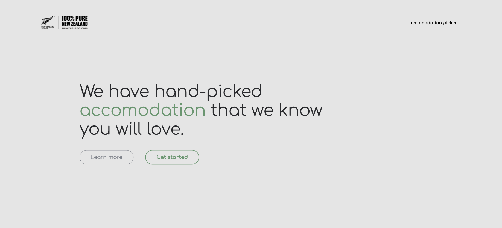

# Accomodation Picker for Tourism New Zealand
Tourism New Zealand is the organisation responsible for marketing New Zealand to the world as a tourist destination. NZ Tourisms’ marketing activity is strategically focused on a number of key markets around the world and a select group of consumers within those key markets. This is so we get the maximum yield for the tourism industry.

Accomodation Picker is a web app that is designed to find an accomodation selection for users who may not have the knowlege to search for thier own accomodation within Aotearoa. The App takes the user through a friendly, personable and trusted questionnaire and asks them about their desired accommodation in Aotearoa and return them with a hand-picked accommodation deal.

*HTML and CSS3 has been validated with the W3S markup validation service.*:white_check_mark: <br>
*Javascript linting done through gulp.*:white_check_mark:

<hr>

<hr>

### Production Tools

#### SCSS
``` scss
$black: #2A2B2E;
$lightGrey: #7E828B;
$green: #5D976C;
$blue: #4A81B7;
$red: #E76A57;
$background: #E5E5E5;
```
``` scss
.accom-selection {
	border: 0.5px solid $lightGrey;
	color: $black;
	text-align: center;
	width: 180px;
	height: 60px;
	padding: 0 20px;
	background: none;
	font-size: 22px;
	font-weight: 200;
	margin-left: 2em;
	margin-top: 0.9em;

	&:hover {
		color: $green;
		border: 1px solid $green;
	}
}
```

### Javascript
I have followed the principles of the [Idiomatic](https://github.com/rwaldron/idiomatic.js/) style guide to help writing consistant and clean javascript.


``` snip
var hotel = document.getElementById('hotel');
var motel = document.getElementById('motel');
var hostel = document.getElementById('hostel');
var house = document.getElementById('house');

function accomOptions() {
  if (peopleNumber > data.hotel.people.max || nightsNumber > data.hotel.nights.max) {
    hotel.classList.add('hide');
  } else {}
  // Motel
  if (peopleNumber < data.motel.people.min || nightsNumber > data.motel.nights.max) {
    motel.classList.add('hide');
  } else {}
  // hostel
  if (peopleNumber > data.hostel.people.min || nightsNumber > data.hostel.nights.max) {
    hostel.classList.add('hide');
  } else {}
  // House
  if (nightsNumber < data.house.people.min) {
    house.classList.add('hide');
  }
  accomOptions();
```

### Plugins & API
* jQuery
``` scss
$('#lunch').toggle(function() {
  $('#noMeals').removeClass('crossed');
  $(this).addClass('clicked');
}, function() {
  $(this).removeClass('clicked');
});
```
* fullpage.js
``` scss
$('#fullpage').fullpage({
  menu: '#menu',
  lockAnchors: true,
  anchors: ['firstPage', 'secondPage'],
  showActiveTooltip: true,
  dragAndMove: false,
  autoScrolling: true,
  scrollHorizontally: true,
  controlArrows: false,
  keyboardScrolling: false,
  loopHorizontal: false,
  horizontalCentered: false,
  scrollingSpeed: 100,
  easingcss3: 'ease 1s',
});
```
* mapbox
``` scss
var map = new mapboxgl.Map({
  container: 'map', // container id
  style: 'mapbox://styles/mapbox/streets-v11', // style URL
  center: [175.553949, -39.235196], // starting position [lng, lat]
  zoom: 10 // starting zoom
});
```
